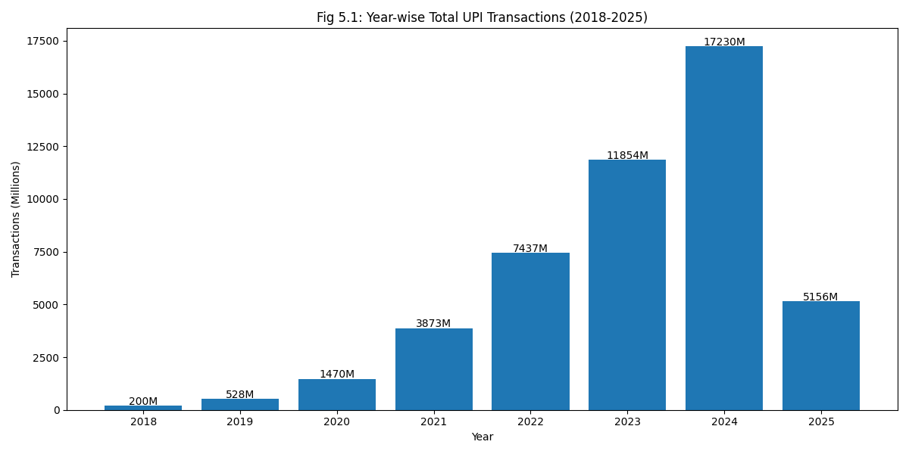
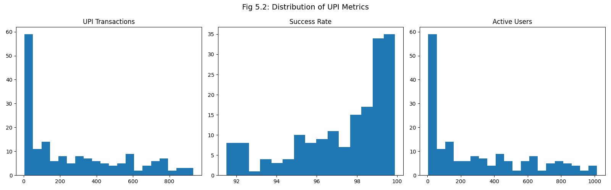
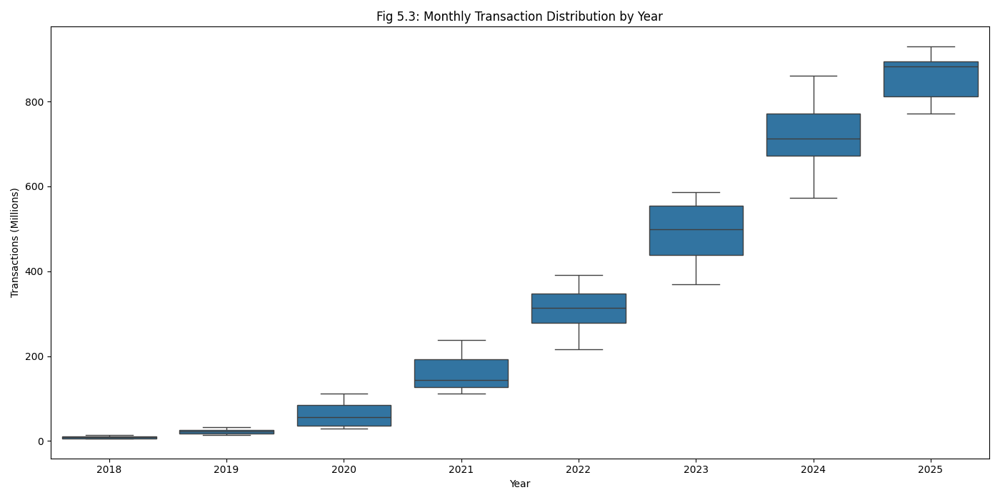
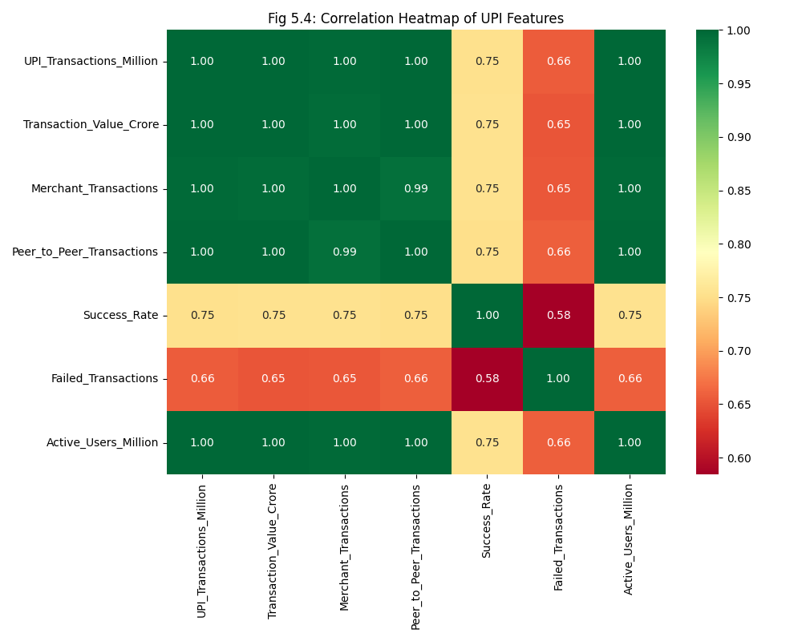
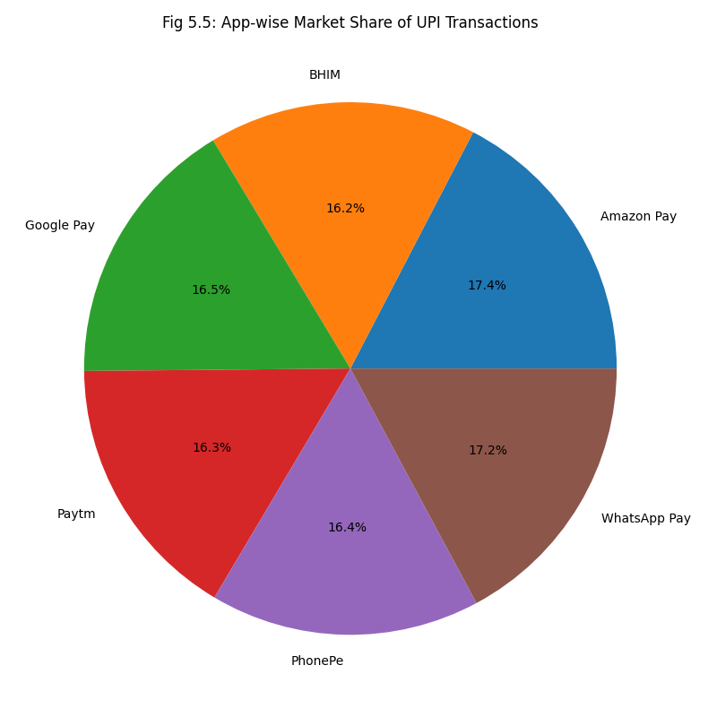
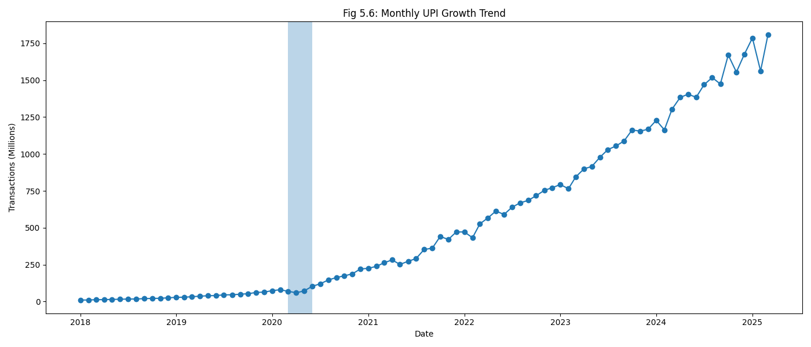
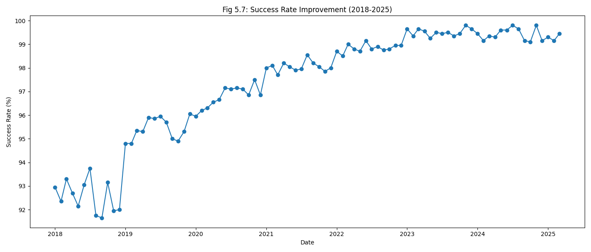
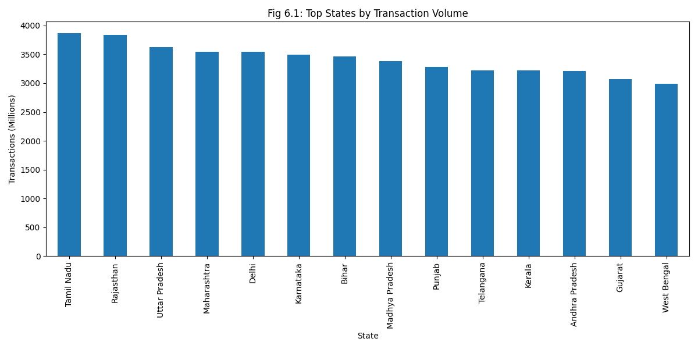
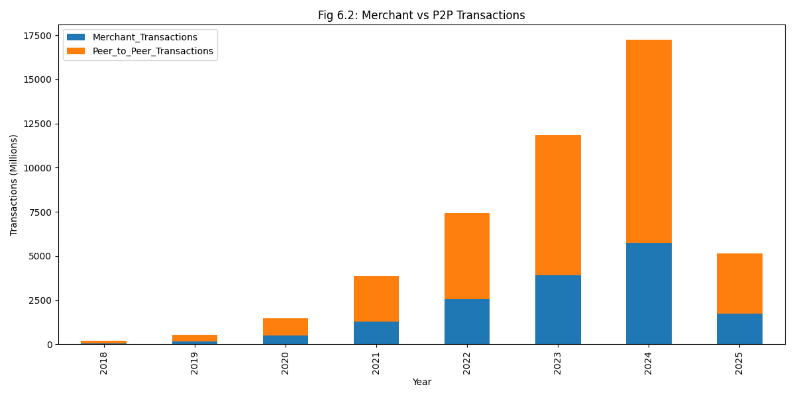

# Digital India: Growth of UPI Transactions

A Python-based data visualization and exploratory analysis project that studies the growth, trends, and structural patterns of Unified Payments Interface (UPI) transactions in India from 2018 to 2025.

## 📌 Project Overview

This project analyzes UPI transaction data using Python and data visualization techniques to understand the rapid growth of digital payments in India.

The analysis covers transaction volume, transaction value, success rates, active users, P2P and merchant transactions, application-wise distribution, and state-wise transaction patterns.

## 🎯 Objectives

- Analyze the growth of UPI transactions from 2018–2025.
- Perform Exploratory Data Analysis (EDA).
- Identify trends and patterns in UPI transaction data.
- Compare UPI applications and Indian states.
- Analyze transaction success rates.
- Study the impact of the COVID-19 period on UPI transactions.
- Visualize complex data using different chart types.

## 📊 Dataset

**Dataset:** `upi_transactions_india.csv`

- Records: 174
- Features: 12
- Time Period: January 2018 – March 2025
- Data Type: Structured CSV dataset
- Geographical Coverage: 10 major Indian states
- UPI Applications: PhonePe, Google Pay, Paytm, BHIM, Amazon Pay, WhatsApp Pay

### Key Features

- Year
- Month
- UPI Transactions
- Transaction Value
- Bank Name
- State
- App Name
- Merchant Transactions
- Peer-to-Peer Transactions
- Success Rate
- Failed Transactions
- Active Users

## 🛠️ Technologies Used

- Python
- Pandas
- NumPy
- Matplotlib
- Seaborn

## 🔍 Analysis Performed

### Data Preprocessing
- Null value checking
- Duplicate checking
- Month-to-number conversion
- Date feature creation
- Outlier detection using IQR

### Exploratory Data Analysis
- Descriptive statistics
- Correlation analysis
- Year-wise analysis
- Application-wise analysis
- State-wise analysis

## 📈 Visualizations

The project generates the following visualizations:

1. Year-wise UPI Transaction Bar Chart
2. UPI Metrics Histograms
3. Monthly Transaction Box Plot
4. Correlation Heatmap
5. UPI Application Market Share Pie Chart
6. Monthly UPI Growth Line Graph
7. UPI Success Rate Graph
8. State-wise Transaction Bar Chart
9. Merchant vs P2P Stacked Bar Chart
10. ## 📊 Visualizations

### 1. Year-wise UPI Transaction Growth



### 2. Distribution of UPI Metrics



### 3. Monthly Transaction Distribution by Year



### 4. Correlation Heatmap



### 5. UPI Application Market Share



### 6. Monthly UPI Growth Trend



### 7. UPI Success Rate Improvement



### 8. State-wise Transaction Volume



### 9. Merchant vs P2P Transactions



## 🔑 Key Insights

- UPI transactions show strong growth throughout the analyzed period.
- Transaction success rates improve significantly over time.
- UPI application usage shows a concentrated market distribution.
- State-wise transaction volumes vary considerably.
- The COVID-19 period shows a temporary disruption followed by strong growth.
- Transaction volume, transaction value, active users, and other growth metrics show strong relationships.

## ▶️ How to Run

### 1. Clone the repository

```bash
git clone https://github.com/lvbhoomika25-jpg/Digital-India-UPI-Data-Visualization.git
